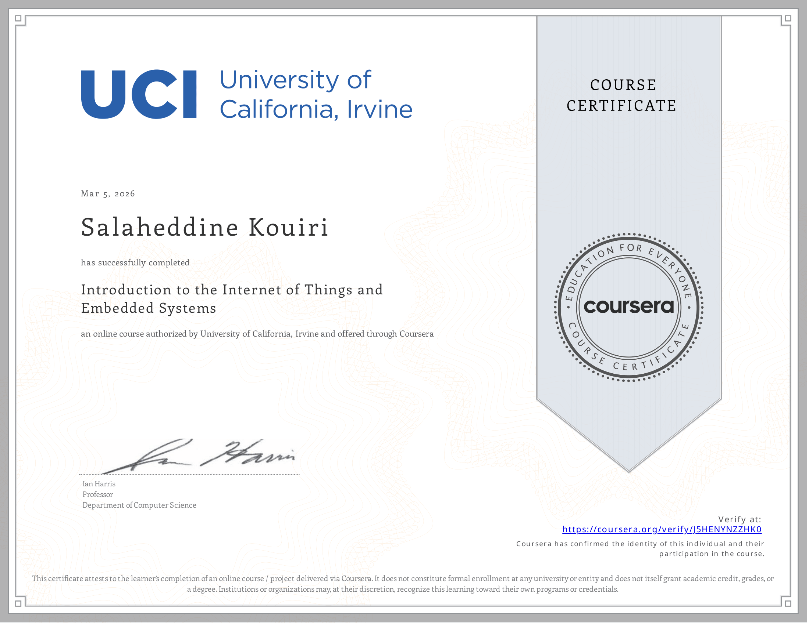
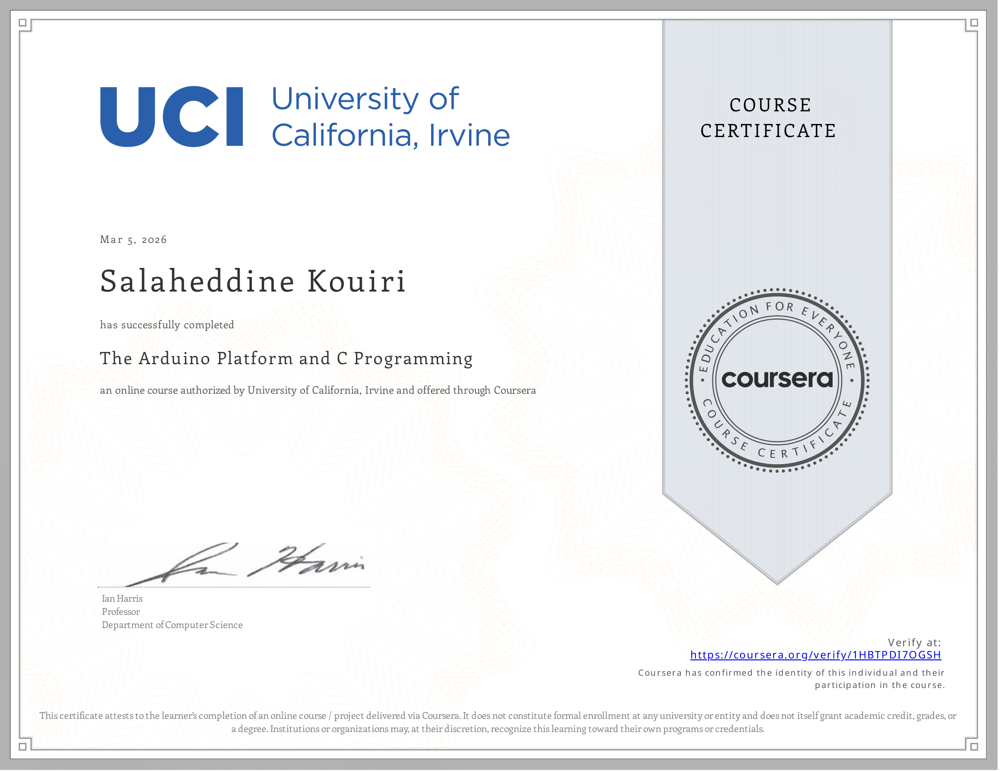

# LPRI Internship — First Steps (IoT Training)

This document summarizes the **initial phase of my internship at LPRI (Laboratoire Pluridisciplinaire de Recherche et Innovation)** under the supervision of **Soufiane Ameur**.

During this phase, the goal was to introduce me to **IoT systems, embedded development, and communication between devices** before moving to more advanced robotics work.

---

# 1. IoT Foundations (Coursera Courses)

To build a foundation in IoT systems, I completed two courses from **UC Irvine (UCI) on Coursera**:

• **Introduction to the Internet of Things and Embedded Systems**  
• **The Arduino Platform and C Programming**

These courses introduced important concepts such as:

- microcontrollers
- sensors and actuators
- embedded programming
- IoT system architecture
- communication between devices

Course links:

- [Introduction to IoT and Embedded Systems](https://coursera.org/share/5cbfdf77d056b5945e9a74e41df0acea)  
- [Arduino Platform and C Programming](https://coursera.org/share/939bc75bc08b66a9d455368e95e9e928)

course certificates : 



---




---

# 2. Arduino Distance Reporter

My mentor then gave me an **Arduino board** and a **distance sensor** and asked me to build a simple system that reads and reports the measured distance.

The objective was to create a **distance reporter** that prints the sensor readings.

### System Architecture
```
Distance Sensor
↓
Arduino
↓
Serial Monitor
```

The Arduino reads the distance from the sensor and sends the values to the **Arduino IDE Serial Monitor**.

Example output:

**I didnt take pictures because i wasnt planning on creating this repo , i ll make sure to add media to my documentation next time**

---

# 3. Data Visualization with Node-RED

After successfully reading the sensor data, the next task was to **visualize the distance values over time**.

Using **Node-RED**, I created a flow that graphs the distance measurements in real time.

### Architecture
```
Distance Sensor
↓
Arduino
↓
Node-RED
↓
Real-time graph
```

Example Node-RED flow:

**I didnt take pictures because i wasnt planning on creating this repo , i ll make sure to add media to my documentation next time**

---

# 4. Distance Alert System (Email Notification)

The next step was to create a **simple automation rule**.

Using Node-RED, I implemented logic that sends an **email notification** when the distance becomes lower than a defined threshold.

### Logic
```
If distance < threshold
↓
Send email alert
```
This demonstrates a simple **proximity alert system**, which can be used in applications such as:

- obstacle detection
- security monitoring
- automated notifications

Example Node-RED automation flow:

**I didnt take pictures because i wasnt planning on creating this repo , i ll make sure to add media to my documentation next time**

---

# 5. ESP32, WiFi, and MQTT Communication

After working with Arduino and Node-RED, my mentor introduced the **ESP32 microcontroller**.

The task was to:

1. Connect the ESP32 to **WiFi**
2. Use the **HiveMQ public MQTT broker**
3. Publish messages using **MQTT**
4. Connect **Node-RED as an MQTT subscriber**

### System Architecture
```
ESP32
↓
WiFi
↓
HiveMQ MQTT Broker
↓
Node-RED Subscriber
↓
Data visualization / processing
```
This exercise introduced me to:

- MQTT communication
- IoT messaging protocols
- connecting embedded devices to software systems
- integrating hardware with Node-RED workflows

Example MQTT flow:

**I didnt take pictures because i wasnt planning on creating this repo , i ll make sure to add media to my documentation next time**

---

# Documentation Note

At the time I completed these experiments, I was **not yet planning to create this repository**, so I did not capture screenshots or photos of the setup.

For future experiments and projects, I will make sure to document:

- hardware setups
- circuit diagrams
- Node-RED flows
- experiment outputs

so that the development process is better recorded.

---

# Summary

During this initial phase of the internship, I gained hands-on experience with several important IoT technologies:

- Arduino programming
- distance sensors
- Node-RED data visualization
- event-based automation
- ESP32 networking
- MQTT communication

These experiments served as a **foundation for upcoming robotics work**, including the **robot car project using the AgileX LIMO platform**.
